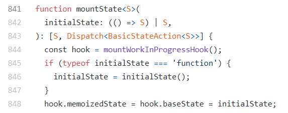

### React 정리

#### Scroll

- 스크롤이 맨 위에 있을 때 : scrollTop = 0
- 스크롤이 맨 아래에 있을 때 : scrollTop = scrollHeight - clientHeight

#### 불변성
- React 에서 상태를 업데이트 할 때는 기존 상태를 그대로 두면서 새로운 값을 상태로 설정해야 한다.
- Array 에 값을 추가할 경우 push X ( 원본에 추가 ) , concat O ( 새로운 배열에 원본 내용과 추가할 내용 모두 추가 )

#### Hook

- useState()
    - useState() 의 매개변수로 function 타입이 올 경우 마운트시에
` initialState = initialState()` 로 인해 useState() 의 매개변수가 function 의 결과값으로 치환되어 마운트되는 처음에만 실행된다.

