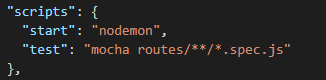
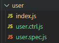
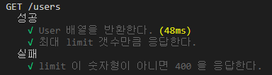
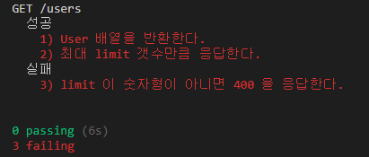

### TDD


### [Mocha](https://mochajs.org/) : Node.js Test Framework
```
npm i mocha should supertest --save-dev
```

- package.json 에 `script` 에 `'test' : 'mocha routes/**/*.spec.js` 추가.

    

- user 폴더 생성, 하위 파일 생성

    

- `index.js` 파일 작성

`routes/user/user.spec.js`
```js
const router = require('express').Router()
const ctrl = require('./user.ctrl')

router.get('/', ctrl.getUsers)

module.exports = router
```

- `user.spec.js` 작성

`routes/user/user.spec.js`
``` js
const app = require('../../app')
const should = require('should')
const request = require('supertest')

const success = '성공'
const fail = '실패'


describe('GET /users', () => {
    describe(success, () =>{
        it('User 배열을 반환한다.', (done) => {
            request(app)    // app 모듈 실행
                .get('/users')  // GET 으로 '/users' 요청
                .end((err, res) => {
                    res.body.should.be.instanceOf(Array) // response body type : Array
                    done()  // 해당 테스트의 끝을 알림.
                })
        })

        it('최대 limit 갯수만큼 응답한다.', (done) => {
            request(app)
                .get('/users?limit=2')  
                .end((err, res) => {
                    res.body.should.have.lengthOf(2)    // response body length : 2
                    done()
                })
        })
    })
    describe(fail, () =>{
        it('limit 이 숫자형이 아니면 400 을 응답한다.', (done) => {
            request(app)
                .get('/users?limit=two')
                .expect(400)    // response status : 400 
                .end(done)
        })
    })
})
```

- 터미널에 ` npm test ` 실행

    

- 실패ㅠㅠ

    

- 성공하기 위해 `user.ctrl.js`에 로직 작성
  
`routes/user/user.ctrl.js`
```js
const getUsers = async (req, res) => {
    const limit = parseInt(req.query.limit || 10, 10) // default limit: 10
    if(Number.isNaN(limit)) return res.status(400).end()
    const users = await User.findAll({
        limit : limit
    })

    res.json(users)
}
```

- 터미널에 `npm test` 실행
  
    

