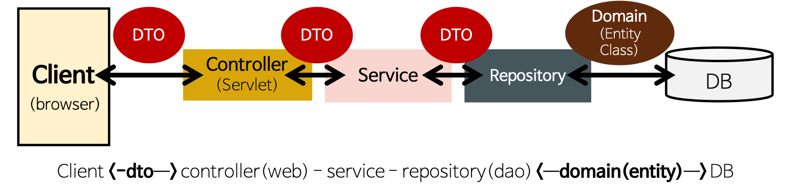
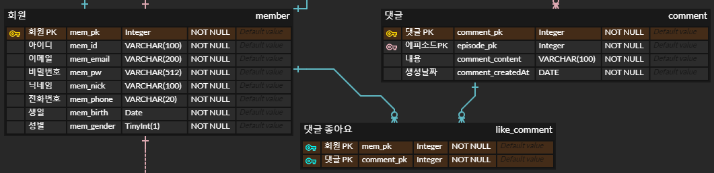

## JPA ( Java Persistense API ) 
- Java SE와 EE를 사용하는 응용프로그램에서 관계형 데이터베이스의 관리를 표현하는 자바 API

- #### 구성요소
  - javax.persistance 패키지로 정의된 API
  - JPQL ( Java Persistence Query Language )
    - 관계형 데이터베이스에 저장된 엔티티에 대한 쿼리들을 작성
    - 쿼리들은 구문에서 SQL 쿼리와 유사하지만, 데이터베이스 테이블에 직접적으로 처리하지 않고 엔티티 개체에 대하여 처리된다.
  - 객체 / 관계 메타데이터

#### build.gradle
```groovy
dependencies{
  compile('org.springframework.boot:spring-boot-starter-data-jpa') // 1
  compile('com.h2database:h2') // 2
}
```

- ### 1. spring-boot-starter-data-jpa
  - 스프링 부트용 Spring Data Jpa 추상화 라이브러리
  - 스프링 부트 버전에 맞춰 자동으로 JPA관련 라이브러리들의 버전을 관리
- ### 2. h2
  - 인메모리 관계형 데이터베이스
  - 별도의 설치가 필요 없고 프로젝트 의존성만으로 관리 가능
  - 메모리에서 실행되어 어플리케이션 재시작마다 초기화가 되어 테스트 용도로 많이 사용
  
### DTD vs Entity

- #### DTO ( Data Transfer Object)
  - 계층간 데이터 교환을 위한 객체(Java Beans)
  - Request와 Response 용 DTO는 View를 위한 클래스
- #### Entity
  - 실제 DB의 테이블과 매칭될 클래스
  - Entity 클래스는 DB의 테이블 스키마와 1:1 매칭된 구조로 정의된다.
  - Setter 메소드 X
    - 클래스의 인스턴스 값들이 언제 어디서 변해야 하는지 코드상으로 구분할 수 없어 Setter 메소드를 만들지 않음
    - 해당 필드의 값 변경이 필요하면 명확히 그 목적과 의도를 나타낼 수 있는 메소드를 추가

### cascade
- 영속성 전이
- 부모 엔티티의 영속성 상태가 변화할 때, 자식 엔티티의 영속성도 같이 변화하는 기능
- 종류
  - NONE
    - 모든 Cascade 적용X
  - PERSIST
    - 엔티티를 영속화 할 때이 필드에 보유 된 엔티티도 유지합니다. EntityManager가 flush 중에 새로운 엔티티를 참조하는 필드를 찾고이 필드가 CascadeType.PERSIST를 사용하지 않으면 오류이므로이 Cascade 규칙의 자유로운 적용을 제안합니다.
  - REMOVE
    - 엔티티를 삭제할 때, 이 필드에 보유 된 엔티티도 삭제합니다.
    - @ManyToMany 관계에서 절대 사용 X
  - MERGE
    - 엔티티 상태를 병합 할 때, 이 필드에 보유된 엔티티도 병합
  - REFRESH
    - 엔티티를 새로 고칠 때, 이 필드에 보유 된 엔티티도 새로 고침
  - DETACH
    - 부모의 엔티티가 detach()를 수행할 때 연관된 엔티티도 detach() 상태가 되어 변경사항이 반영되지 않음
  - ALL
    - 모든 Cascade 적용

### getOne vs getById
- #### getOne()
  - 메소드가 실행되고 이후에 실제로 엑세스할때 DB에 데이터를 쿠러ㅣ 
- #### getById()
  - 메소드가 실행되면 바로 DB에 데이터를 쿼리

### N:M 관계

- 연결 테이블을 복합키로 처리하는 방법 ( `@ManyToMany` )

```java
class Member {
  // member <-> like_comment >> 댓글 좋아요
  // 이 멤버가 좋아하는 댓글들
  @ManyToMany(mappedBy = "member")
  private List<Comment> likeComments = new ArrayList<>();

public void likeComment(Comment comment){
    likeComments.add(comment);
    comment.getLikedMember().add(this);
  }
  public void unLikeComment(Comment comment){
    likeComments.remove(comment);
    comment.getLikedMember().remove(this);
  }

}
class Comment {
  @ManyToMany
  @JoinTable(
    name = "like_comment",
    joinColumns = @JoinColumn(name = "comment_pk"),
    inverseJoinColumns = @JoinColumn(name = "mem_pk"))	
  private List<Member> likedMembers = new ArrayList<Member>();
}
```

- 연결 테이블의 기본키를 새로 만들고 엔티티로 만들어 처리하는 방법 ( `@ManyToMany`를 `@OneToMany`와 `@ManyToOne`을 이용하여 처리)

```java
class Member {    // 회원
    ...

	// member <-> like_comment >> 댓글 좋아요
	// 이 멤버가 좋아하는 댓글들
	@OneToMany(mappedBy = "member", cascade = CascadeType.REMOVE)
	private List<LikeComment> CommentsLikedMember = new ArrayList<>();
}

class Comment {   // 댓글
    ...
    
	// comment <-> like_comment >> 댓글 좋아요
	// 이 댓글을 좋아하는 멤버들 
	@OneToMany(mappedBy = "comment", cascade = CascadeType.REMOVE)
	private List<LikeComment> MembersLikeComment = new ArrayList<>();
}

class LikeComment{  // 댓글 좋아요
	@Id
    @GeneratedValue(strategy = GenerationType.IDENTITY)
	@Column(name = "like_comment_pk")
	private int likeCommentPk;

	// like_comment <-> member
	@ManyToOne
	@JoinColumn(name = "mem_pk", nullable = false)
	private Member member;
	
	// like_comment <-> comment
	@ManyToOne
	@JoinColumn(name = "comment_pk", nullable = false)
	private Comment comment;
}
```

#### 출처
- [https://gmlwjd9405.github.io/2018/12/25/difference-dao-dto-entity.html](https://gmlwjd9405.github.io/2018/12/25/difference-dao-dto-entity.html)
- [https://yonguri.tistory.com/69](https://yonguri.tistory.com/69)