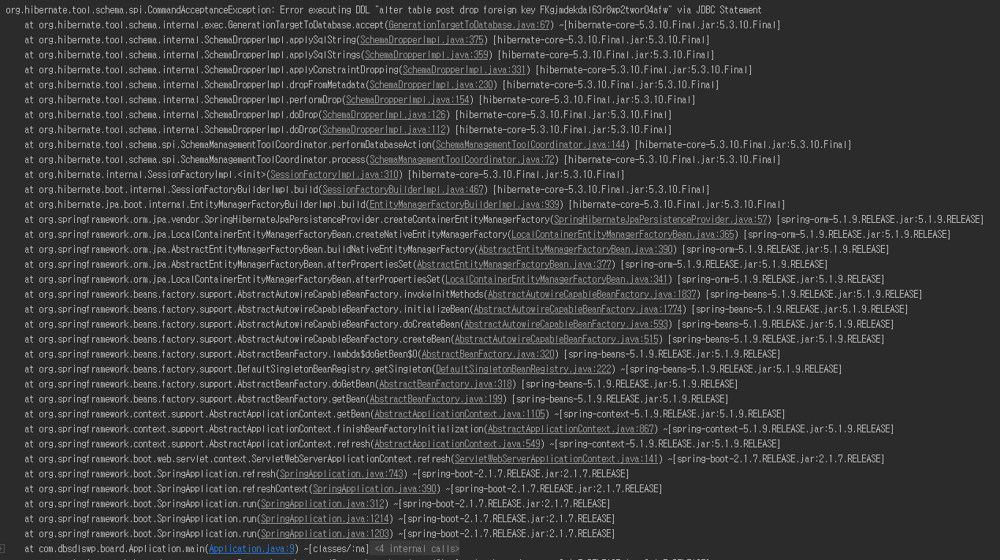

#### build.gradle
```groovy
dependencies{
  compile('org.springframework.boot:spring-boot-starter-data-jpa') // 1
  compile('com.h2database:h2') // 2
}
```

- ### 1. spring-boot-starter-data-jpa
  - 스프링 부트용 Spring Data Jpa 추상화 라이브러리
  - 스프링 부트 버전에 맞춰 자동으로 JPA관련 라이브러리들의 버전을 관리
- ### 2. h2
  - 인메모리 관계형 데이터베이스
  - 별도의 설치가 필요 없고 프로젝트 의존성만으로 관리 가능
  - 메모리에서 실행되어 어플리케이션 재시작마다 초기화가 되어 테스트 용도로 많이 사용


```java
@Getter // 필드에 대한 get 메소드 자동 추가
@NoArgsConstructor // 기본 생성자 자동 추가 :: public Post(){}
@Entity // 테이블과 링크될 클래스
public class Posts {

    @Id // 테이블의 PK
    @GeneratedValue(strategy = GenerationType.IDENTITY) // PK의 생성 규칙. IDENTITY : auto_increment
    private Long id; //

    @Column(length = 500, nullable = false) // 테이블의 컬럼. 기본값이 아닌 필요한 옵션이 있을경우 사용
    private String title;

    @Column(columnDefinition = "TEXT", nullable = false)
    private String content;

    // @Column 이 없으면 기본값으로 설정
    private String author;

    @Builder // 해당 클래스의 빌더 패턴 클래스 생성
    public Posts(String title, String content, String author){
        this.title = title;
        this.content = content;
        this.author = author;
    }
}

@RunWith(SpringRunner.class)
@SpringBootTest
public class PostsRepositoryTest {
    @Autowired
    PostsRepository pRepo;

    @After // Junit 에서 단위 테스트가 끝날 때마다 수행되는 메소드
    public void cleanup(){
        pRepo.deleteAll();
    }

    @Test
    public void 게시글저장_불러오기(){
        //given
        String title = "테스트 게시글";
        String content = "테스트 본문";
        String author = "dbsdlswp@naver.com";
        pRepo.save(
            Posts.builder().
                title(title).
                content(content).
                author(author).
                build()
        );

        //when
        List<Posts> postsList  = pRepo.findAll();

        // then
        Posts posts = postsList.get(0);
        Assertions.assertThat(posts.getTitle()).isEqualTo(title);
        Assertions.assertThat(posts.getContent()).isEqualTo(content);
        Assertions.assertThat(posts.getAuthor()).isEqualTo(author);
    }
}
```

### DDL AUTO 옵션 ( spring.jpa.hibernate.ddl-auto )
- JPA 의 Database 초기화 전략
- 종류
  - none
    - 아무것도 실행하지 않음.
  - create-drop
    - SessionFactory가 올라갈 때 테이블을 지우고 새로 만듬 ( sql문을 별도로 만들어서 데이터를 넣는 용도로 사용 가능 )
  - create-drop
    - create와 동일하지만, SessionFactory가 내려가면 해당 테입르을 drop
  - update
    - SessionFactory가 올라갈 때 Object를 검사하여 테이블을 alter 시킨다. 데이터는 유지됨
  - validate
    - update처럼 Object를 검사하지만, 스키마는 아무것도 건드리지 않고, Object와 스키마의 정보가 다르면 에러를 발생시킨다.


### Error
- #### Error executing DDL "alter table user drop foreign key"

  - 발생 원인
    - alter할 테이블을 찾지 못하여 발생
  - 해결책
    - application.properties파일에 `spring.jpa.hibernate.ddl-auto=update` 추가


#### 출처
- [https://galid1.tistory.com/610](https://galid1.tistory.com/610)