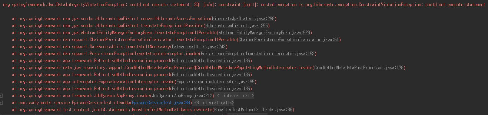
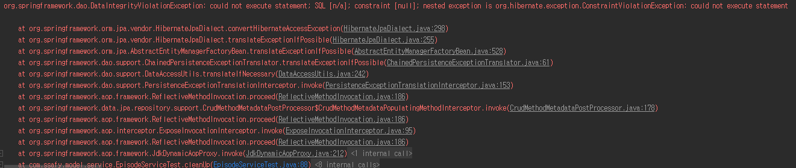
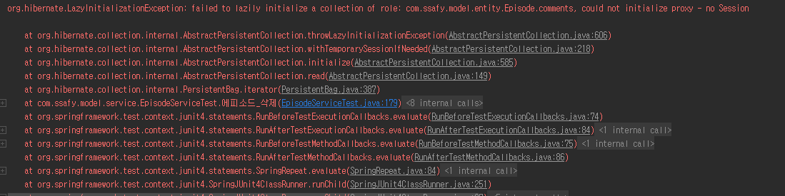
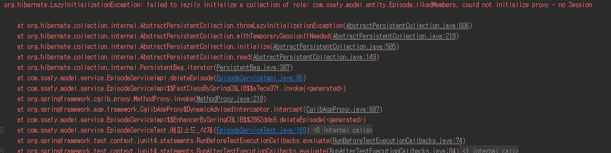

- Episode
  - 에피소드 삭제
    - 사실
      - @Transactional
        - test method O
          - service method O
            
          - service method X
            
        - test method X
          - service method O
            
          - service method X
            
    - 결론
      - Service 에서의 `@Transactional`은 데이터의 무결성 때문에 사용.
      - test method 에서 `@Transactional`을 사용하지 않으면 `LazyInitializationException` 예외 발생
        - `LazyInitializationException` 발생 원인
          1. org.hibernate.exception.ConstraintViolationException : `Comment` 엔티티가 `Member`엔티티를 가지고 있을 때, `Comment` 엔티티를 삭제하지 않고 `Member` 엔티티를 삭제함.
          2. org.hibernate.PropertyValueException : 엔티티의 변수에 `nuallable = flase` 처리가 되어있지만 `null`값이 들어감.
          3. org.hibernate.exception.DataException
