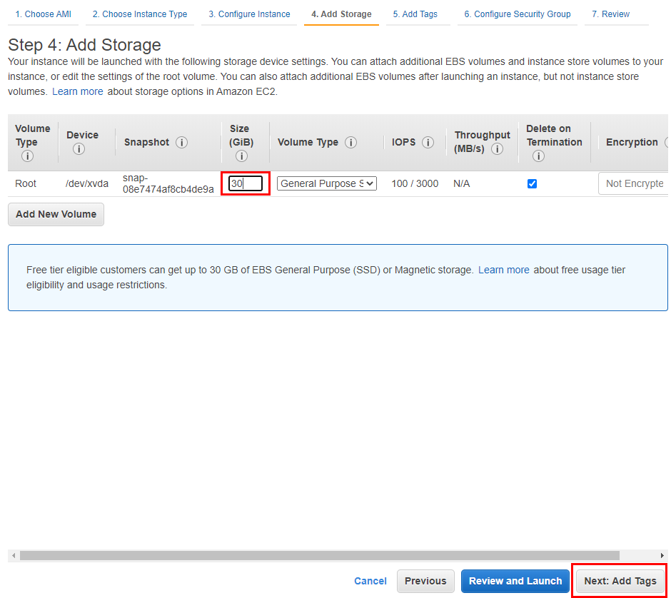

## AWS 인스턴스 생성

- ### 01 AWS 이미지 선택
  
  - Q. **Amazon Linux2**를 선택하지 않고 **Amazon Linux** 이유
    - A. 국내 자료가 더 많기 때문

- ### 02 AWS 인스턴스 유형 선택
  
  - t2 : 요금 타입
    - **T 시리즈**는 **범용시리즈**라 불림
    - **T 시리즈**는 다른 서비스와 달리 **크레딧**으로 CPU를 사용
      - **크레딧** : CPU를 사용할 수 있는 포인트 개념. 크레딧을 모두 사용하게 되면 EC2를 사용하지 못함 
  - micro : 사양

- ### 03 AWS 인스턴스 세부정보 구성
  
  - 기업에서 사용할 경우 화면상에 표기된 VPC, 서브넷 등을 설정

- ### 04 스토리지 추가
  
  - 프리티어의 하드디스크의 최대치는 30GB

- ### 05 태그 추가
  
  - 여러 인스턴스가 있을 경우 태그별로 구분하여 검색이나 그룹을 짓기 편하다.
  - Name이라는 키에 first-aws-test라는 값 입력

- ### 06 보안 그룹 추가
  
  - **SSH**이면서 포트 항목에서 **22**인 경우 : **AWS EC2에 터미널로 접속**
  - pem키 관리와 지정된 IP에서만 SSH 접속이 가능하도록 구성하는것이 안전
  - 프로젝트의 기본 포트를 추가 ( 8080 )

- ### 07 인스턴스 시작 검토
  

- ### 08 Pem 키 생성
  
  - Pem 키 다운로드 받아서 잘 보관

- ### 09 인스턴스 생성 완료
  
  

- ### 10 EIP 할당
  - **EIP ( Elastic IP )** : AWS의 고정 IP
  
  
  
  
  