## EC2 서버에 접근하기

- ### 1. puttyGen.exe 실행

  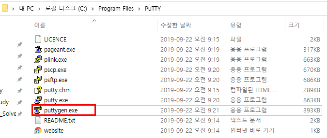

- ### 2. PPK 파일 생성

  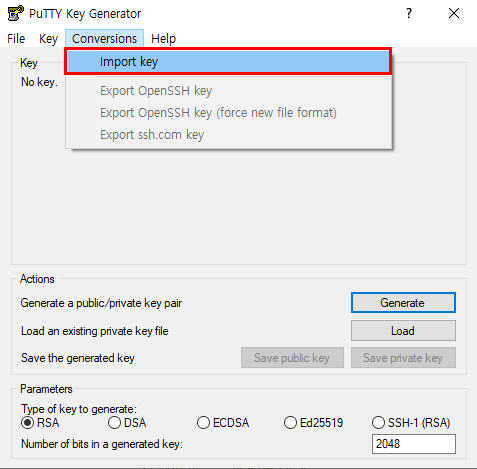

  - pem키를 선택한다.

  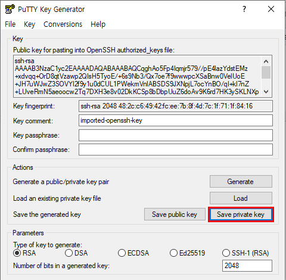
  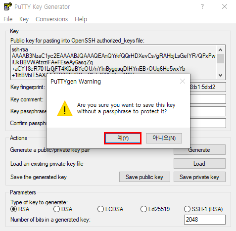
  - ppk 파일을 저장

- ### 3. putty.exe 실행

  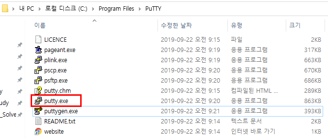

- ### 4. 

  - HostName : username@public-ip ( Amazon Linux의 username : ec2-user )
  - Port : SSH 접속 포트인 22 등록
  - Connection Type : SSH 선택

  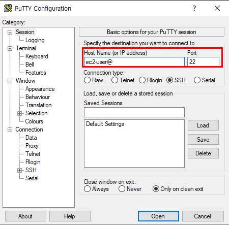
  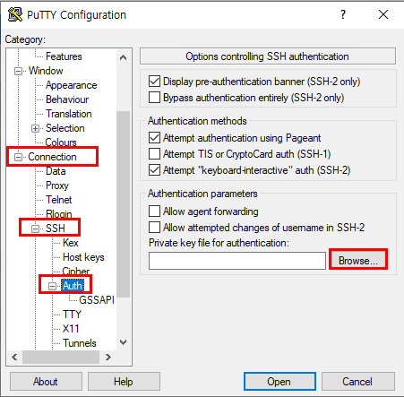

  - PPK 파일 선택

  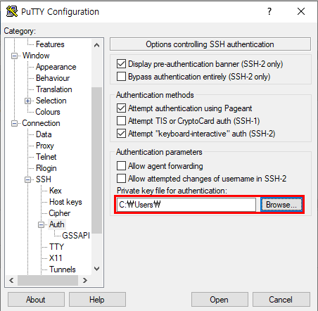
  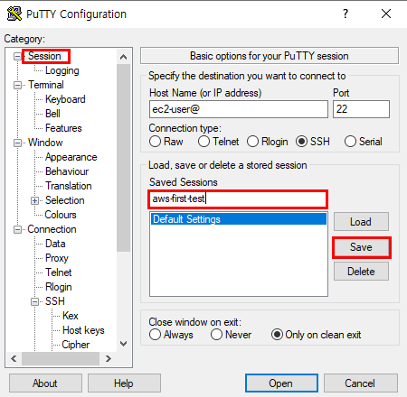

  - 세션 선택 후 open 버튼 클릭

  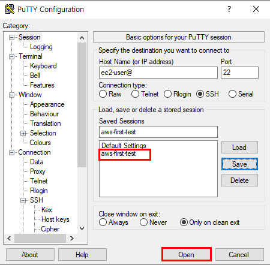
  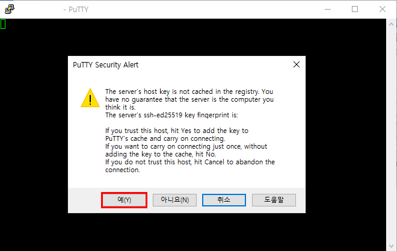
  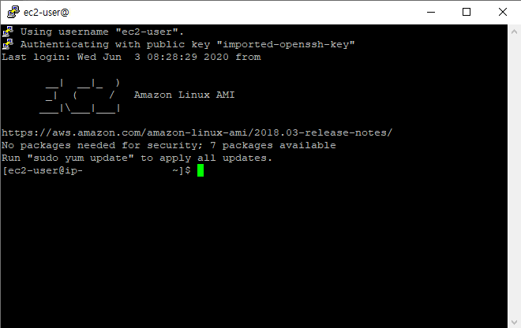