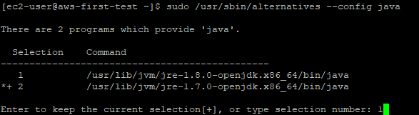
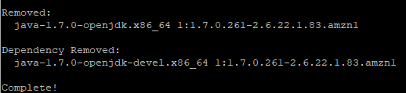
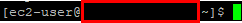
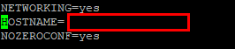
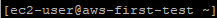
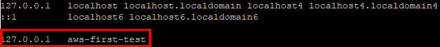
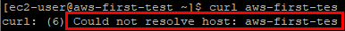
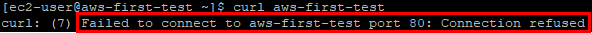

## 아마존 리눅스1 서버 생성 시 필수 설정

- ### Java 8 설치 및 설정
  - 아마존 리눅스 1의 경우 기본 Java 버전이 7 ( 8 버전으로 바꿔줘야 한다. )
    - 자바 8버전 설치
      ` sudo yum install -y java-1.8.0-openjdk-devel.x86_64 ` 

    - 인스턴스의 Java 버전을 8로 변경
      ` sudo /usr/sbin/alternatives --config java `
      

    - 사용하지 않는 Java 7 삭제
      ` sudo yum remove java-1.7.0-openjdk `
      

- ### 타임존 변경
  - /etc/localtime 파일이 현재 시간에 대한 파일인듯 하다. 삭제하자.
    ` sudo rm /etc/localtime `

  - `/usr/share/zoneInfo` 폴더에 있는 파일들은 각 도시의 시간에 대한 파일인듯 함.
  - `/etc/localtime` 으로 필요한 시간을 복붙
    ` sudo ln -s /usr/share/zoneinfo/Asia/Seoul /etc/localtime `

- ### 호스트 네임 변경
  - HOSTNAME
    
  
  - HOSTNAME을 설정하는 파일을 vim 에디터로 열기
    ` sudo vim /etc/sysconfig/network `

  - 빨간 사각형의 텍스트를 원하는 서비스명 으로 변경
    

  - 인스턴스 리부트
    ` sudo reboot `

  - 짜잔
    

  - 호스트 주소를 찾을 때 가장 먼저 검색해 보는 `/etc/hosts`에 변경한 hostname 추가
    ` sudo vim /etc/hosts `
    
  
  - 확인
    ` curl 등록한 호스트 이름 `
    - `/etc/hosts`에 등록 실패인 경우
      
    - `/etc/hosts`에 등록 성공인 경우 ( 80번 포트로 접근이 안된다는 에러 )
      