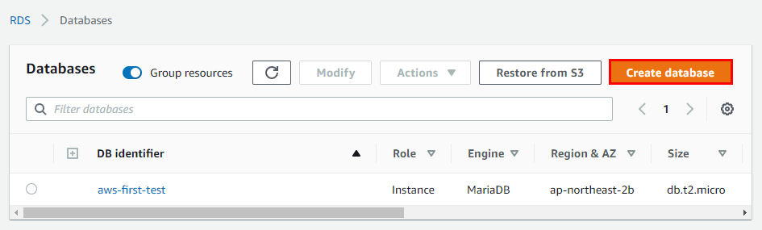
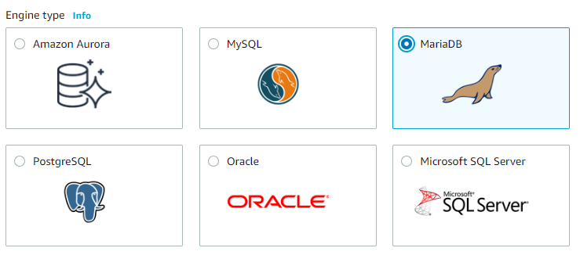
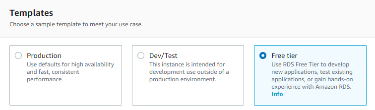
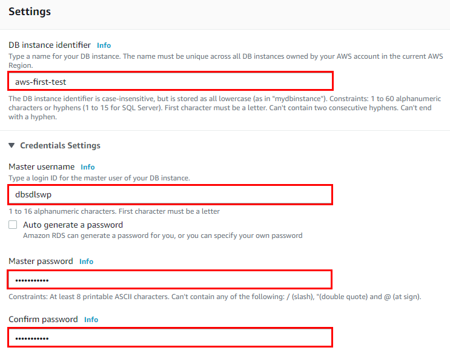
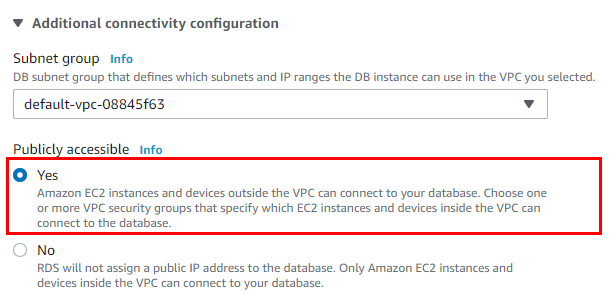
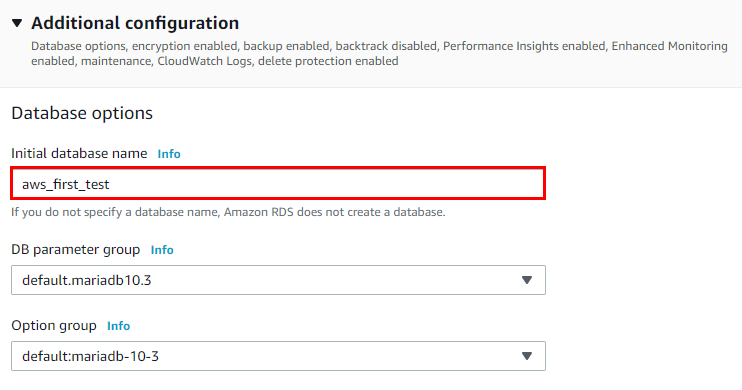
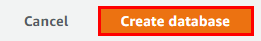
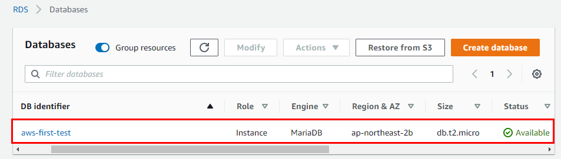

## AWS RDS 인스턴스 생성
  

  - ### DB 선택
    - 본인이 가장 잘 사용하는 DB를 고르면 됨
    - DB 선택의 특별한 이유가 없다면 추천
      - MySQL
        - 타 DB 대비 단순 쿼리 처리 성능 압도적
      - MariaDB ( 가장 추천 )
        - MYSQL을 기반으로 만들어짐
        - 동일 하드웨어 사양으로 MySQL보다 향상된 성능
        - 좀 더 활성화된 커뮤니티
        - 다양한 기능
        - 다양한 스토리 엔진
        - MySQL 문법 사용
      - PostgreaSQL 
    - 추천 이유
      - 가격
      - **Amazon Aurora** 교체 용이성
        - **Amazon Aurora**
          - 클라우드 서비스에 가장 적합한 DB
          - MySQL과 PostGreSQL을 클라우드 기반에 맞게 재구성한 DB
          - MySQL의 5배, PostGreSQL의 3배 성능 제공 ( 압도적 ; )
          - 프리티어 대상이 아님
        
    
  
  - ### 버전은 자유

  - ### Templates
    

  - ### Storage 설정
    - `20`으로 설정

  - ### 상세정보 설정
    - DB instance identifier : 프로젝트 이름 기입
    - Master username : 내가 사용할 아이디 기입
    - password : 내가 사용할 비밀번호 기입
    
    

    - Public accessible : yes 설정
      - 이후 보안 그룹에서 지정된 IP만 접근 가능하도록 막을 예정

    

    - Initial database name : 내가 사용할 DB 이름 기입

    

  - Create DataBase
    

  - ### 짜자잔
    
  