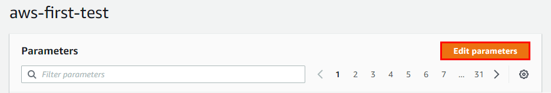
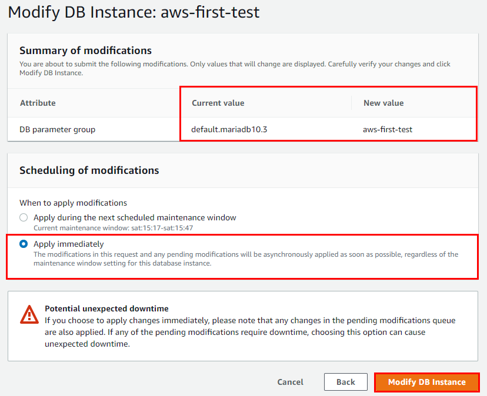

## RDS 운영환경에 맞는 파라미터 설정
  
  
  
  

  - ### TimeZone
    - Asia/Seoul 로 지정
      
  - ### Character Set
    - `character` 항목은 `utf8mb4`로 설정
      - character_set_client
      - character_set_connection
      - character_set_database
      - character_set-filesystem
      - character_set-results
    
    - `collation` 항목은 `utf8mb4_general_ci` 로 설정
      - collation_connection
      - **collaction_server**
        - 이거 설정하면 아래 에러가 발생할 수 있으니 후에 콘솔에서 설정하는 것을 추천
      

    - `utf8`과 `utf8mb4`의 차이는 이모지 저장 여부 ( 이모티콘 )
      - `utf8` : 이모지 저장 X
      - `utf8mb4` : 이모지 저장 O

  - ### Max Connection
    - 150으로 설정
      

  - ### Save Changes
    

  - ### DB에 파라미터 그룹 연결
    

    - DB parameter group : 이전에 생성한 파라미터 그룹 선택
    
  
  - ### 설정 저장
     

  - ### 수정 사항 바로 적용
    

  - ### 적용중
    

  - ### 짜자잔
    

  - ### 재부팅
    - 간혹 파라미터 그룹이 제대로 반영되지 않는 경우가 있어 재부팅
    
    