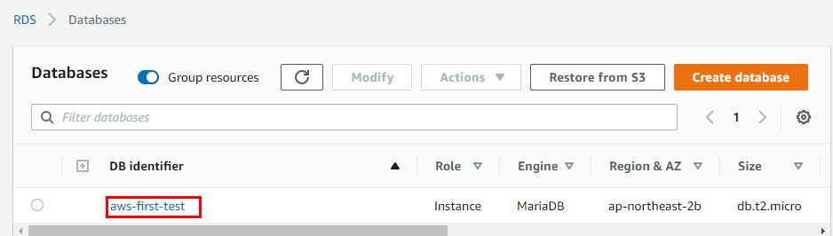
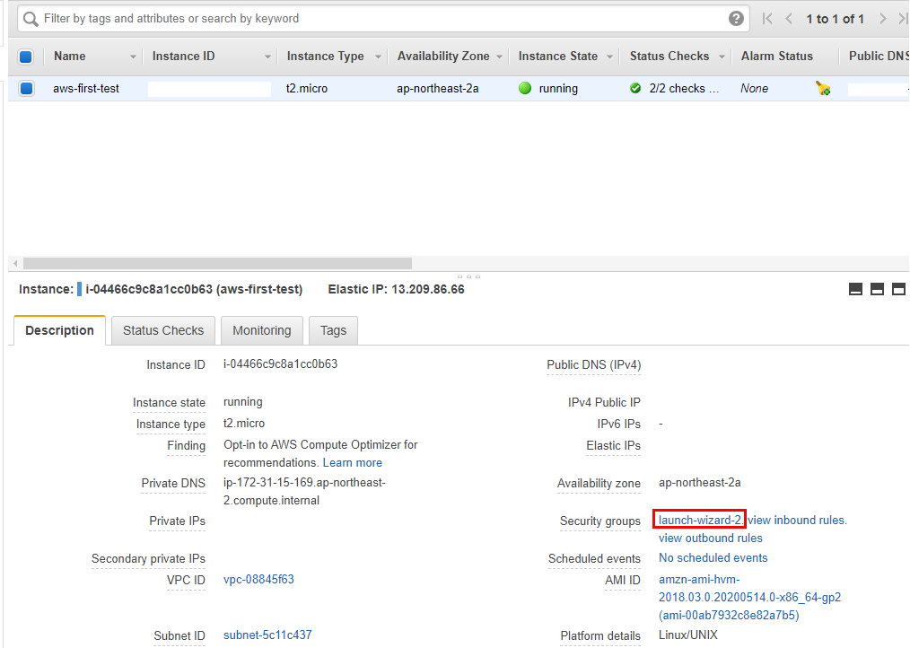
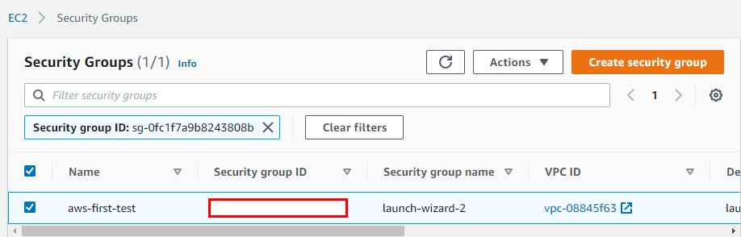
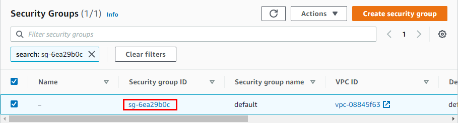
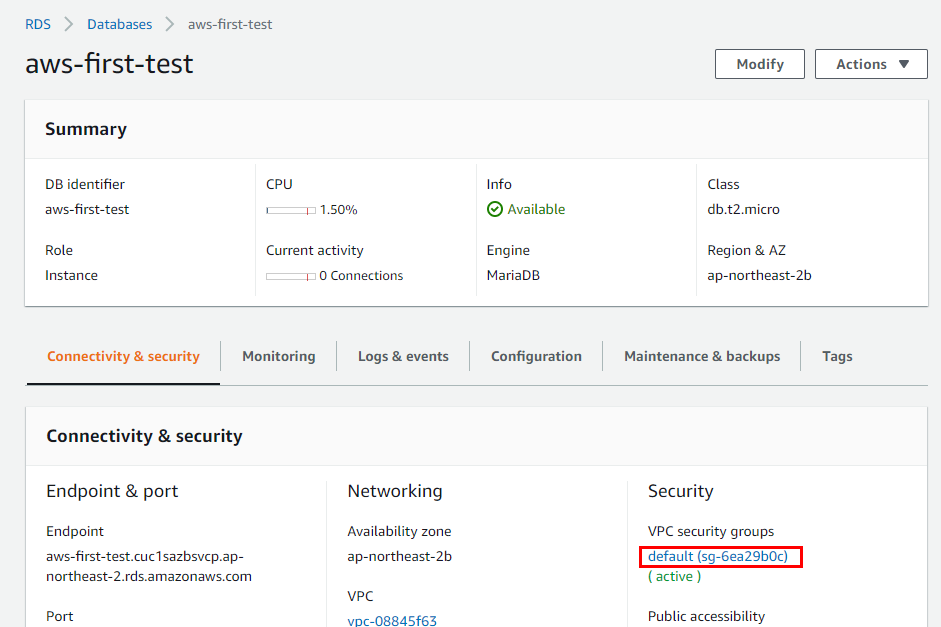
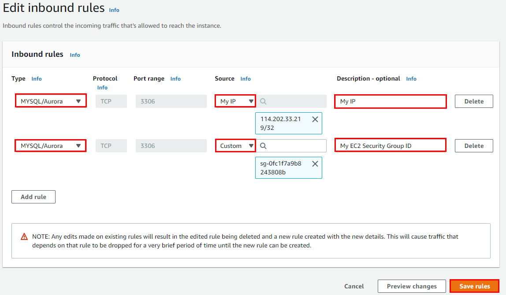
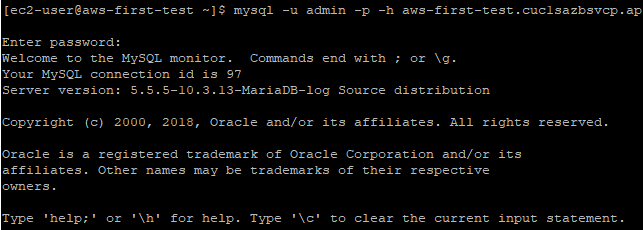

## 내 PC에서 RDS 접속
- ### RDS 보안그룹 설정
  - DB instance 상세 페이지
  

  - Security Group 인바운드 규칙 설정
    - `EC2` 인스턴스의 `Security Group`의 ID를 복사
      
      
  
    - `RDS` 인스턴스의 인바운드 규칙 설정
      
      
      

      - 내 IP에 대한 규칙 추가
        - Type : `MySQL/Aurora`
        - Source : `My IP` 
      - 복사한 Security Group ID에 대한 규칙 추가
        - Type : `MySQL/Aurora`
        - Source : `Custom`, 옆 빈칸에 Security Group Id 붙여넣기
      

  - `EC2`에서 `RDS` 접근 확인 
    - MySQL EC2에 설치
      ` sudo yum install mysql `
    
    - `계정`, `비밀번호`, `호스트 주소`를 통해 `RDS` 접속
      ` mysql -u admin -p -h aws-first-test.cuc1sazbsvcp.ap-northeast-2.rds.amazonaws.com `
      