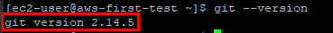
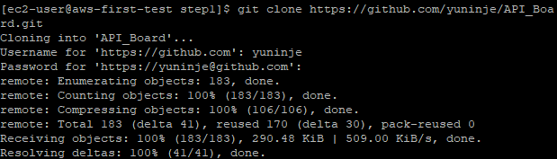

## EC2 서버에 프로젝트 배포

- ### EC2에 Git 설치
  - 설치 명령어
  ` sudo yum install git `
  - 버전 확인으로 설치 상태 확인
  ` git --version `
  

- ### EC2에 프로젝트 Clone 받기
  - git clone 으로 프로젝트를 저장할 디렉터리 생성
    ` mkdir ~/app && mkdir ~/app/step1 `
  
  - 생성된 디렉터리로 이동
    ` cd ~/app/step1 `

  - Git Clone
    ` git clone 프로젝트-주소 `
    
  

  