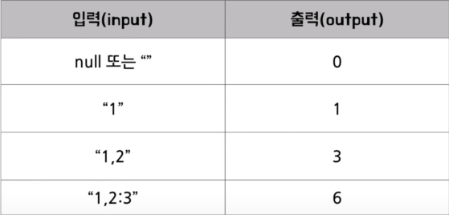
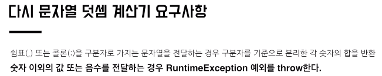
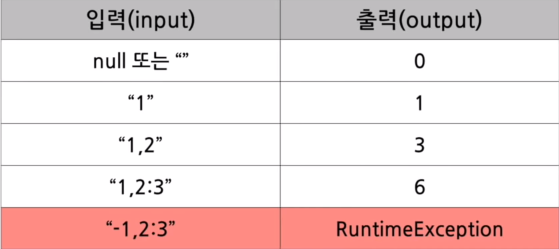

# 서론
## 1만 시간의 재발견

### 의식적인 연습의 7가지 원칙
- 효과적인 훈련 기법이 수립되어 있는 기술 연마
- 개인의 **컴포트 존을 벗어난 지점에서 진행, 자신의 현재 능력을 살짝 넘어가는 작업을 지속적으로 시도**
- **명확하고 구체적인 목표**를 가지고 진행
- 신중하고 계획적이다. 즉 개인이 온전히 집중하고 '의식적'으로 행동할 것을 요구
- **피드백과 피드백에 따른 행동 변경**을 수반
- 효과적인 심적 표상을 만들어내는 한편으로 심적 표상에 의존
- **기존에 습득한 기술의 특정 부분을 집중적으로 개선함으로써 발전시키고 수정**하는 과정을 수반

## 우아한테크 코스 프리코스
- ### 진행 방식
  - 매주 해결해야할 미션을 부여하면서 3주간 진행
  - 미션을 완료한 후 Github의 Pull Request(PR)로 제출
  - 각 PR 평가 후 공통 피드백
- ### 설계 목표
  - 선발 과정이지만, 3주 동안 배움이 있는 과정

- ### 1주차
  - #### 프로그래밍 제약사항
    - **자바 코드 컨벤션을 지키면서 프로그래밍**한다.
      - 참고문서
        - http://google.github.io/styleguide/javaguide.html
        - https://myeonguni.tistory.com/1596
    - **indent(인덴트, 들여쓰기) depth를 3이 넘지 않도록 구현한다. ( 2까지만 허용 )**
      - 힌트
        - indent(인덴트, 들여쓰기) depth를 줄이는 좋은 방법은 함수(또는 메소드)를 분리하는 것
    - **함수(또는 메소드)가 한 가지 일만 하도록 최대한 작게** 만들어라.

  - #### 피드백
    - **space(공백)도 convention이다.**
      - for, while, if문 사이의 space도 convention이다.
    - **불필요하게 공백 라인을 만들지 않는다.**
      - 공백 라인을 띄우는 것도 코드상에 문맥이 달라지는 부분에 의도를 가지고 띄우면 좋다.
    - **git commit 메시지를 의미있게 작성한다.**
      - commit 메시지에 해당 commit에서 작성한 내용에 대한 이해가 가능하도록 작성한다.
    - 등등..

- ### 2주차
  - #### 프로그래밍 제약사항
    - **함수(또는 메소드)의 길이가 15라인을 넘어가지 않도록 구현**한다.
      - 함수(또는 메소드)가 한 가지 일만 잘 하도록 구현한다.
    - **else 예약어를 쓰지 않는다.**
      - 힌트
        - if 조건절에서 값을 `return`하는 방식으로 구현하면 `else`를 사용하지 않아도 된다.
        - `else`를 쓰지 말라고 하니 `switch/case`로 구현하는 경우가 있는데 `switch/case`도 허용하지 않는다.

  - #### 피드백
    - **java api를 적극 활용**한다.
      - 메소드를 직접 구현하기 전에 java api에서 제공하는 기능인지 검색을 해본다.

- ### 3주차
  - #### 프로그래밍 제약사항
    - **함수(또는 메소드)의 길이가 10라인을 넘어가지 않도록 구현**한다.
      - 함수(또는 메소드)가 한 가지 일만 잘 하도록 구현한다.
    - **indent(인덴트, 들여쓰기) depth를 2이 넘지 않도록 구현한다. ( 1까지만 허용 )**
      - **최대한 1을 유지하기 위해 노력하고, 정말 힘든 경우 2까지 허용**
    - **함수(또는 메소드)의 인자 수를 3개까지만 허용한다. 4개 이상은 허용**하지 않는다.
  - #### 피드백
    - **객체에 메시지를 보내라.**
      - 상태 데이터를 가지는 객체에서 데이터를 꺼내려(get)하지 말고 객체에 메시지를 보내라.
      ```java
      private boolean isMaxPosition(Car car){
        return car.getPosition() == maxDistance;
      }
                      ↓
      private boolean isMaxPosition(Car car){
        return car.isMaxPosition(maxDistance);
      }
      ```

# 본론 ( TDD )
- ### TIP
  - TDD, 리팩토링 == 운동
  - 평생동안 연습하겠다는 마음가짐으로 시작
- ### 시작하기
  - **꾸준히 연습할 시간 확보**
  - **장난감 프로젝트** 찾기
  - 내가 사용하는 **API 사용법**을 익히기 위한 학습 테스트에서 시작
    - 자바 String 클래스의 다양한 메소드(함수) 사용법
    - 자바 ArrayList에 데이터를 추가, 수정, 삭제하는 방법
    - 연습 효과
      - 단위테스트 방법을 학습할 수 있다.
      - 단위테스트 도구(xUnit)의 사용법을 익힐 수 있다.
      - 사용하는 API에 대한 학습 효과가 있다.
    ```java
    import org.junit.Test;

    import static org.assertj.core.api.Assertions.assertThat;

    public class StringTest{
      @Test
      public void split(){
        String[] values = "1".split(",");
        assertThat(values).contains("1");
        values = "1,2".split(",");
        assertThat(values).containsExactly("1","2");
      }

      @Test
      public void substring(){
        String input = "(1,2)";
        String result = input.substring(1, input.length() - 1);
        assertThat(result).isEqualTo("1,2");
      }
    }
    ```
    - 내가 구현하는 메소드(함수) 중 Input과 Output이 명확한 클래스 메소드(보통 Util 성격의 메소드)에 대한 단위 테스트 연습
    - 알고리즘을 학습한다면 알고리즘 구현에 대한 검증을 단위 테스트로 한다.
      - 알고리즘은 Input, Output이 명확하기 때문에 연습하기 좋다.

- ### TDD 연습
  - #### TIP
    - 어려운 문제를 해결하는 것이 목적이 아니라 **TDD 연습이 목적**
    - **난이도가 낮거나 자신에게 익숙한 문제로 시작**하는 것을 추천
    - **웹, 모바일 UI나 DB에 의존관계를 가지지 않는 요구사항으로 연습**한다.
  - 문자열 덧셈 계산기 요구사항
    
    ```java
    public class StringCalculator {
      public static int splitAndSum(String text){
        int result = 0;
        if ( text == null || text.isEmpty()){
          result = 0;
        } else {
          String[] values = text.split(",|:");
          for(String value : values){
            result += Integer.parseInt(value);
          }
        }
        return result;
      }
    }
                        ↓
    public class StringCalculator {
      public static int splitAndSum(String text) {
        if (isBlank(text)){
          return 0;
        }
        return sum(toInts(split(text)));
      }

      private static boolean isBlank(String text) {
        return text == null || text.isEmpty();
      }

      private static String[] split(String text) {
        return text.split(",|:");
      }

      private static int[] toInts(String[] values) {
        return Arrays.stream(values).mapToInt(Integer::parseInt).toArray();
      }

      private static int sum(int[] numbers){
        return Arrays.stream(numbers).sum();
      }
    }
    ```
  - 추가 요구사항
    


    

# 미완
  
- ### Reference
  - https://www.youtube.com/watch?v=bIeqAlmNRrA