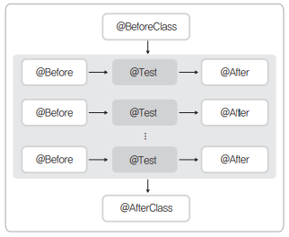
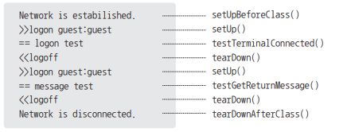

## 2장 - JUnit과 Hamcreset

### Junit 4
- 특징
  - Java 5 Annotation 지원
  - test라는 클자로 method 이름을 시작해야 한다는 제약 해소
    - Test 메소드는 `@Test`를 붙인다.
  - 좀 더 유연한 픽스처
    - `@BeforeClass, @AfterClass, @Before, @After`
  - 예외 테스트
    - `@Test(expected = RuntimeException.class)`
  - 시간 제한 테스트
    - `@Test(timeout = 1000)`
  - 테스트 무시
    - `@Ignore("this method isn't working yet")`
  - 배열 지원
    - `assertArrayEquals([message], expected, actual);`
  - `@RunWith(클래스이름.class)`
    - Junit Test 클래스는 실행하기 위한 러너(Runner)를 명시적으로 지정한다.
    - `@RunWith`는 `junit.runner.Runner`를 구현한 외부 클래스를 인자로 갖는다.
  - `@SuiteClases(Class[])`
    - 보통 여러 개의 테스트 클래스를 수행하기 위해 쓰인다. @RunWith를 이용해 `Suite.class`를 러너로 사용한다.
    ```java
    @RunWith(Suite.class)
    @SuiteClasses(ATest.class, BTest.class, CTest.class) // A -> B -> C 순서로 실행
    public class ABCSuite {
    }
    ```
  - 파라미터를 이용한 테스트   
    ```java
    @RunWith(Parameterized.class)
    @Parameters
    public static Collection data() {
      ...
    }
    ```

- 테스트 실행순서  


- 터미널 클라이언트 프로그램 테스트 클래스
  ```java
  public class TerminalTest {

    private static Terminal term;

    @BeforeClass
    public static void setUpBeforeClass() throws Exception {
      term = new Terminal();
      term.netConnect(); // 터미널에 접속한다.
    }

    @AfterClass
      public static void tearDownAfterClass() throws Exception {
      term.netDisconnect(); // 터미널과의 연결을 해제한다.
    }

    @Before
    public void setUp() throws Exception {
      term.logon("guest", "guest"); // 시스템에 로그온
    }

    @After
    public void tearDown() throws Exception {
      term.logoff(); // 시스템으로부터 로그오프
    }

    @Test // 정상적으로 로그인됐는지 테스트
    public void testTerminalConnected() throws Exception {
      assertTrue( term.isLogon() );
      System.out.println("== logon test");
    }

    @Test // 터미널 메시지 테스트
    public void testGetReturnMessage() throws Exception {
      term.sendMessage("hello");
      assertEquals("world!", term.getReturnMessage());
      System.out.println("= = message test");
    }
  }
  ```
  

### Reference
- https://repo.yona.io/doortts/blog/issue/1